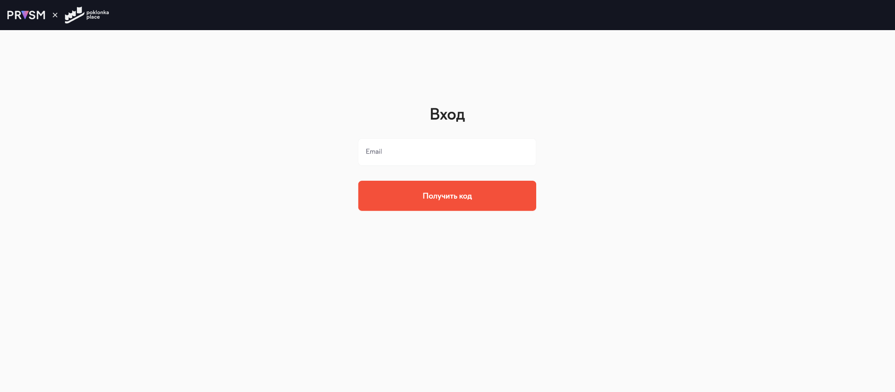

# PRYSM

## 📦 Что это за проект

**PRYSM** — это цифровая платформа для управления коммерческой недвижимостью.  
Проще говоря, это **CRM-система**, в которой удобно вести учёт арендаторов, заявок, платежей, подрядчиков и работы персонала.

С её помощью управляющие компании могут:  
– контролировать, кто заходит в здание и когда,  
– принимать и обрабатывать заявки от арендаторов,  
– отслеживать платежи и аренду,  
– управлять задачами по техническому обслуживанию зданий,  
– видеть общую картину — что происходит на объекте в реальном времени.

PRYSM объединяет всё управление зданием в одной системе.

---

## ⚙️ Что нужно, чтобы всё работало

Перед запуском убедись, что на компьютере установлено:

- **Node.js** версии **20 LTS или выше**  
  👉 Скачать можно с официального сайта: [https://nodejs.org/](https://nodejs.org/)  
  ⚠️ Обрати внимание: нужна **LTS-версия**, она стабильнее и поддерживается дольше.

  После установки можно проверить версию:

  ```bash
  node -v
  ```

  Если показывает `20.x.x` или выше — всё ок ✅

  🔄 Рекомендуем установить Node.js через [nvm](https://github.com/nvm-sh/nvm) — это удобно для переключения между версиями и обновлений.

- **Yarn** — менеджер пакетов  
  👉 Если он не установлен, можно поставить с помощью команды:
  ```bash
  npm install --global yarn
  ```

Больше ничего дополнительно устанавливать не нужно.

---

## ▶️ Как запустить проект

Открой терминал и выполни команды по очереди:

```bash
# 1. Установи зависимости (только один раз при первом запуске):
yarn

# 2. Скопируй файл .env
# ⚠️ Без него проект не запустится.
#    Попроси файл у тимлида или коллеги и положи в корень проекта.

# 3. Запусти проект:
yarn dev
```

После запуска открой в браузер:  
👉 [http://localhost:3000](http://localhost:3000)

🖼️ Если всё настроено правильно — ты увидишь экран входа, как на скриншоте ниже:



---

## 🛠 Полезные команды

```bash
yarn dev             # запустить проект для разработки
yarn build           # собрать проект
yarn preview         # посмотреть собранный проект локально
```

### 🔎 Проверка и исправление кода

```bash
yarn lint            # проверить код на ошибки (TS, JS, TSX)
yarn lint:fix        # автоматически исправить большинство ошибок
```

### 🎨 Проверка стилей (SCSS, CSS)

```bash
yarn lint:styles     # проверить стили на ошибки
yarn lint:styles:fix # автоматически исправить ошибки в стилях
```

---

### 🔐 Прекоммит-проверки

Перед каждым коммитом автоматически запускаются:

- проверка кода (`yarn lint`)
- проверка стилей (`yarn lint:styles`)
- проверка типов (`yarn typecheck`)

Если хотя бы одна из проверок не пройдёт — **коммит не получится сделать**.

📌 Что делать, если не даёт закоммитить:

1. Запусти `yarn lint:fix` и `yarn lint:styles:fix` — это исправит большинство проблем автоматически.
2. **Если упала проверка типов** — её нужно **исправить вручную** (автофикса нет).

После этого снова выполни:

```bash
git add .
git commit -m "..."
```

---

## 🧰 Особенности проекта

- 🔤 В проекте используется [**i18next**](https://www.i18next.com/) для перевода текста в интерфейсе.  
  👉 **Никакие тексты не пишутся напрямую** — всё через `i18next` с переводами.  
  Если нужен новый текст:

  1. Создай ключ в переводах.
  2. **Если нет точного перевода на русский/английский — переводи сам.** Потом можно уточнить у команды.

- 🧪 Для тестирования на разных устройствах и браузерах используется [**BrowserStack**](https://www.browserstack.com/)  
  👉 Доступ можно получить у тимлида (он даст логин и пароль).

---

## 💬 Поддержка

Если что-то не работает — обратись к **тимлиду** проекта. Он поможет разобраться или направит к нужному человеку.

---

## ❓ Часто задаваемые вопросы (FAQ)

**Проект не запускается, что делать?**  
— Проверь, установлены ли `Node.js` и `Yarn`, а также есть ли файл `.env`.

**Что такое `.env` и где его взять?**  
— Это файл с настройками проекта (например, адреса API, ключи и т.п.). Попроси у тимлида.

**Пишу перевод, но не знаю английский**  
— Напиши перевод как получится — главное, чтобы был смысл. Потом вместе уточним и доведём до идеала.
